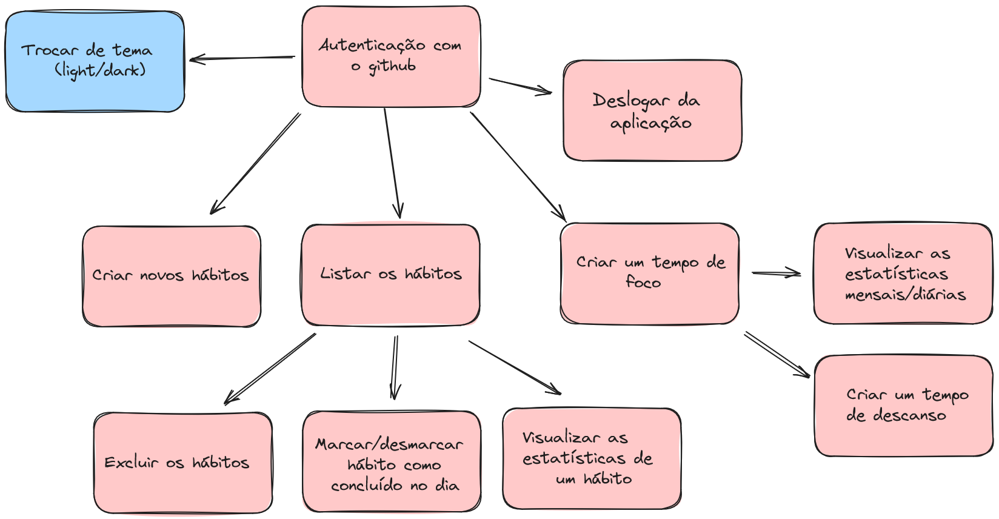

# Elite Tracker

## Jornada do usuário

## Requisitos Funcionais (RF’s)

- O usuário deve poder se autenticar com o GitHub;
- O usuário deve poder se deslogar da aplicação;
- O usuário deve poder criar novos hábitos;
- O usuário deve poder listar os hábitos;
- O usuário deve poder excluir os hábitos;
- O usuário deve poder marcar ou desmarcar hábito como concluído no dia;
- O usuário deve poder visualizar as estatísticas de um hábito;
- O usuário deve poder criar um tempo de foco;
- O usuário deve poder criar um tempo de descanso;
- O usuário deve poder visualizar as estatísticas mensais ou diárias;

## Regras de Negócio (RN’s)

- O usuário poderá ficar logado na aplicação por 8h, depois é deslogado;
- Não deve ser possível cadastrar dois ou mais hábitos com o mesmo nome (independentemente de letras maiúsculas ou minúsculas);
- O usuário só pode listar os hábitos criados por ele mesmo;
- O usuário só pode excluir os hábitos criados por ele mesmo;
- O usuário só pode marcar ou desmarcar como concluído os hábitos criados por ele mesmo;
- O usuário só pode visualizar as estatísticas de hábitos criados por ele mesmo;
- O usuário só pode visualizar as estatísticas dos tempos de foco criados por ele mesmo;

## Requisitos não Funcionais (RNF’s)

- Autenticação com o GitHub + JWT;
- Backend com TypeScript + Express.js  ||  Java;
- Frontend com TypeScript + ReactJS;
- Banco de Dados NoSQL (MongoDB);

## Arquitetura da API
### MVC
- Model -> Responsável por se comunicar com o banco;
- View -> Mostrar isso para o usuário (React - Frontend);
- Controller -> Controla a requisição, chama a Model, define as Regras de Negocios

## Design da API

- POST /habits → Cria um novo hábito;
- GET /habits → Lista todos os hábitos;
- DELETE /habits/:id → Excluir um hábito;
- PATCH /habits/:id/toogle →  Marca/desmarca o hábito como concluído;
- GET /habits/:id/metrics?date=2024-01-01 → Mostra as estatísticas de um hábito;
- POST /focus-times → Cria um tempo de foco concluído;
- GET /focus-times/metrics/month?date=2024-01-01 → Mostra as estatísticas de tempo de foco no mês;
- GET /focus-times/metrics/day?date=2024-01-08 → Mostra as estatísticas de tempo de foco no dia;
- POST /auth → Logar com o GitHub;